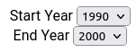

# About

A React App for visualisation of green house gases emission data for various countries. 

# Setup

1. clone the repo -> <br/>
```
git clone https://github.com/raman20/bsa_assignment.git
```

2. change to directory and install packages -> <br/>
```
npm install
```

3. move to <b>./Data_cleaning</b> dir. and run data cleaner code<br/>
```
cd Data_cleaning
node data_cleaner.js
```
4. This will make a ```clean_data.json``` file with cleaned data, move this file to ```./src``` dir.

5. run the app -><br>
```
npm start
```
this will run the app on localhost:3000

# Main React Components

## DataSelector

### Usage
```
import DataSelector from './src/components/data_input/data_selector';

<DataSelector />
```


### Props

| name | type | required | Description |
| ---- | ----- |---------|-------------|
| flag | String | yes |  Data indicator| 
| dataList | Array | yes | Select Data List |
| allData | Array | yes | All possible Data |
| addData | Function | yes | Function to set state |
| removeData | Function| yes | remove data from parent state |
<hr/><br/><br/>

## TimePeriod
### Usage
```
import TimePeriod from "./components/data_input/time_period"

<TimePeriod />
```



### Props

| name | type | required | Description |
| ---- | ----- |---------|-------------|
| startYear | String | yes |  | 
| endYear | String | yes |  |
| setStartYear | Function | yes |  |
| setEndYear | Function | yes |  |
| allYears | Function| yes |  |
<hr/><br/><br/>


## Chart
### Usage
```
import Chart from './components/chart/chart';

<Chart />
```


### Props

| name | type | required | Description |
| ---- | ----- |---------|-------------|
| DATA | Object | yes |  All Data | 
| countryList | Array | yes | Selected country List |
| paramList | Array | yes | Selected Parameter List |
| startYear | String | yes | |
| endYear | String | yes |  |
<hr/><br/><br/>


## Map
### Usage
```
import Map from './components/map/map';

<Map />
```


### Props

| name | type | required | Description |
| ---- | ----- |---------|-------------|
| DATA | Object | yes |  All Data | 
| countryList | Array | yes | Selected country List |
| paramList | Array | yes | Selected Parameter List |
| startYear | String | yes | |
| endYear | String | yes |  |
